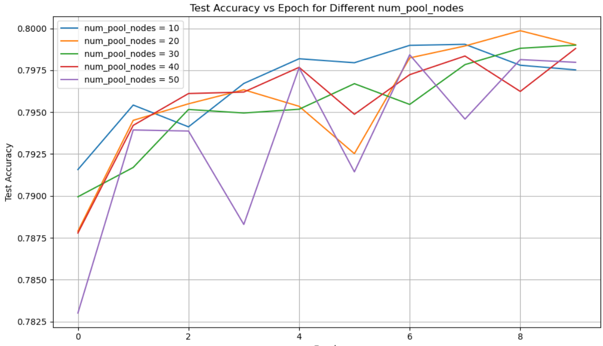

# GNN with Differentiable Pooling for Quark-Gluon Jet Classification

This project implements a hierarchical Graph Neural Network (GNN) model for binary classification of particle jets (quark vs. gluon), using the DiffPool mechanism. The architecture is inspired by the paper "Hierarchical Graph Representation Learning with Differentiable Pooling" by Ying et al. ([arXiv:1806.08804](https://arxiv.org/abs/1806.08804)).

## Model Overview

Given an unknown jet, represented as a set of particles, the model performs the following steps:

1. **Graph Construction via KNN**  
   A graph is built for each jet using k-nearest neighbors (k=8), computed in the (η, φ) space normalized relative to the jet axis. This forms the edge_index defining the particle connectivity.

2. **Node Feature Extraction with GCNs**  
   Two successive GCNConv layers allow each particle to update its features based on its neighbors, resulting in richer, context-aware embeddings.

3. **Assignment Matrix (S) Computation**  
   A third GCNConv layer outputs a soft assignment matrix S, where each row represents how strongly a particle is associated with each cluster. Shape: [#particles × #clusters].

4. **Differentiable Pooling (DiffPool)**  
   Using S, the graph is coarsened into a new graph where nodes represent clusters of particles. The key point: this operation is differentiable, so the model can learn the optimal way to cluster nodes during training via backpropagation.

5. **Graph-Level Pooling and Classification**  
   After pooling, we compute the average embedding across clusters to get a fixed-size representation of the entire jet. This is passed through a fully connected network to predict the jet class.

## Performance

- The model was trained on approximately 25% of the full dataset.
- Achieved a test accuracy of around 80% on unseen jets.
- Performance depends significantly on the number of clusters used in the DiffPool step.

## Cluster Sensitivity

Below is a comparison of model performance across different values of `num_pool_nodes` (number of clusters used during DiffPool):

As shown, tuning the number of clusters is useful for optimizing model performance.

## Credits

Model inspired by:
- Ying et al., "Hierarchical Graph Representation Learning with Differentiable Pooling" ([arXiv:1806.08804](https://arxiv.org/abs/1806.08804))
- Graph-based approaches in high energy physics machine learning

